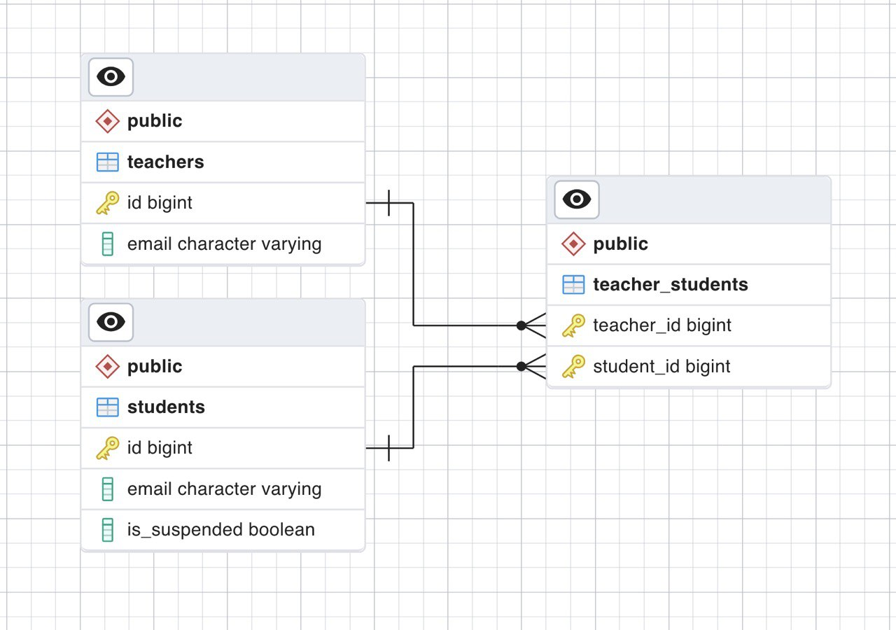

# GDS-ONECV-SWE Take-home assignment

### Project structure
(TODO)

### Database Schema

While emails are used to identify the teachers and students, auto-incrementing bigint id fields are used as primary keys for the `teachers` and `students` tables for better extensibility (e.g. we may want to allow teachers/students to update their email addresses in the future)

### Local Development

**Environment variables**

Set the environmental variables as follow
| Key | Value | Remarks |
|--------------|--------------------------------------|-----------------------------------------------------------------------|
| DB_DIALECT | postgres | |
| DB_HOST | database | `database` is the name of the golang server service in docker-compsoe |
| DB_PORT | 5432 | |
| DB_USER | | e.g. user |
| DB_NAME | | e.g. postgres |
| DB_PASSWORD | | e.g. mysecretpassword |
| SERVER_PORT | 8000 | |
| SERVER_HOST | server | `server` is the name of the golang server service in docker-compsoe |

### Commit messages

This project follows [conventional commits](https://www.conventionalcommits.org/en/v1.0.0/) guideline for commit messages. See the table below for the list of commit types.

| Type     | Description                                                                                            |
| -------- | ------------------------------------------------------------------------------------------------------ |
| feat     | A new feature                                                                                          |
| fix      | Bug fixes                                                                                              |
| test     | Adding missing tests or correcting existing tests                                                      |
| refactor | Changes to source code that neither add a feature nor fixes a bug                                      |
| build    | Changes to CI or build configuration files (Docker, github actions)                                    |
| chore    | Anything else that doesn't modify any `internal` or `test` files (linters, configs, etc.)              |
| revert   | Reverts a previous commit                                                                              |
| docs     | Documentation only changes                                                                             |
| perf     | A code change that improves performance                                                                |
| style    | Changes that do not affect the meaning of the code (white-space, formatting, missing semi-colons, etc) |
